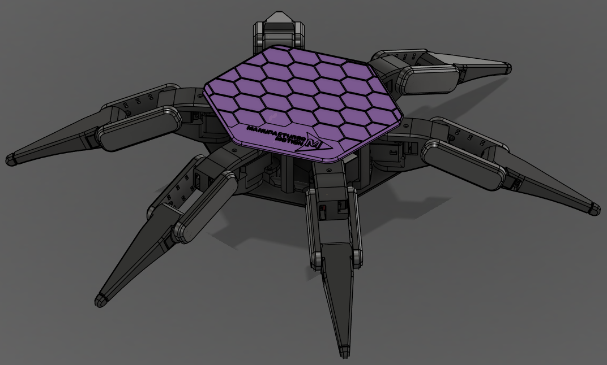
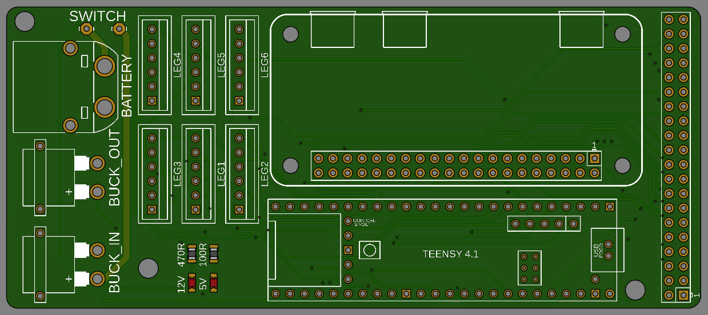
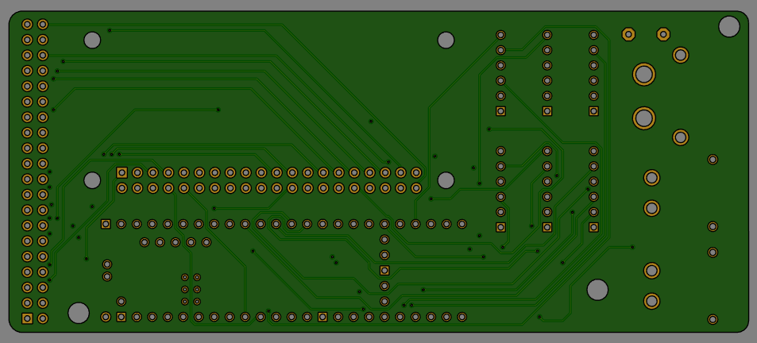

# Hex1

!!! warning "Hex1 Deprecated"
    Hex1 is deprecated as of August 2024.

    The files for Hex1 are still available, but may be incomplete due to the project pivot.

    We strongly recommend building the current Hex2/Hex3+ design instead, as Hex1 has known hardware and software limitations.

    All aspects of the system are being improved in later versions, including printed parts and electronics.

---

## Overview

This version of the Hexapod was completed in Summer 2024. It came in under the $500 budget and used a Raspberry Pi Zero W and Teensy 4.1 for control.

While Hex1 was a successful proof of concept (Bluetooth control, basic gait, etc.), it quickly became clear that both hardware and software would limit future development.

Because of this, development moved toward Hex2 and beyond.

---

## CAD Model

---

## Electronics

---

## Hex1 Project Glossary

- [3D Models](https://github.com/ManufacturedMotion/Hexapod/tree/main/Hex1_resources/CAD)
- [Bill of Materials](https://github.com/ManufacturedMotion/Hexapod/tree/main/Hex1_resources/BOM)
- [Teensy Code](https://github.com/ManufacturedMotion/Hex1/tree/main/real_time)
- [Raspberry Pi Zero Code](https://github.com/ManufacturedMotion/Hex1/tree/main/non_real_time)
- [Electronics](https://github.com/ManufacturedMotion/Hexapod/tree/main/Hex1_resources/electronics)

---

## License

MIT LICENSE