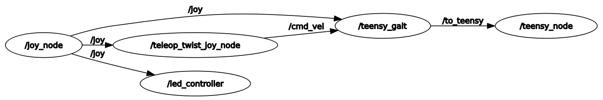

!!! note
    The following are useful commands to have handy when experimenting with or debugging your hexapod.

## Docker Containers
The following are commands used to setup or run a docker container for our environment. They would be run from inside the `mk2/code/non_real_time/container/` directory on your pi

* `./init_dev.sh`
  * initialize the docker container environment
* `./new_dev_shell.sh`
  *  opens a new shell in the container

## Ros2 Packages & Nodes
These commands are expected to be run inside of a development container (see above)

Here is an rqt graph showcasing the relationship of our custom nodes



* `ros2 launch control xbox.yml`
  * launches the joy and cmd_vel nodes used for communicating with the pi via xbox controller. This launch requires the xbox controller to be on and connected to the pi via bluetooth before being run.
* `ros2 run teensy_node teensy_node`
  * launches a node responsible for pi <-> teensy serial communication.
* `ros2 run gait teensy_gait`
  * launches a node that allows the hexapod to be remote controlled with the xbox controller. Operation requires that you have also launched xbox.yml.
* `ros2 run hexapod_manager led_controller`
  * launches a node responsible for controlling the led ring on the bottom of the hexapod. Can be used alongside xbox.yml to give color and mode toggling capabilities. 
* `ros2 topic echo <topic>` 
  * listens in to the specified topic. available options are `/from_teensy`, `/to_teensy`
* `ros2 launch hexapod_manager user_controlled.yml`
  * launches the controller, leds, and teensy nodes needed for wireless walking control

## Serial Commands
When LOG_LEVEL is set to a value greater than 1 in user_config.hpp, the user is able to send instructions to the teensy via serial. The command formats are as follows:

### Presets
* `{"PRE": "Z"}`
  * The hexapod will move all motors to their zero positions
* `{"PRE": "SIT"}`
  * The hexapod will sit down
* `{"PRE": "STND"}`
  * The hexapod will stand up

### Movement Instructions
* The hexapod will execute the `hexapod.rapidMove` function to move to the specified position:

```bash
{"MV": "RPD", "X": <x>, "Y": <y>, "Z": <z>, "ROLL": <roll>, "PTCH": <pitch>, "YAW": <yaw>}
```

* The hexapod will execute the `hexapod.walkSetup` function to move to the specified position at the specified speed:

```bash
{"MV": "WLK", "X": <x>, "Y": <y>, "Z": <z>, "ROLL": <roll>, "PTCH": <pitch>, "YAW": <yaw>, "SPD": <speed>}
```

* MTPS is used to set all 18 motors to a specified position, in this example all motors go to pos 0. Not all motors must be specified, but it is desired. If any motor is not specified in the command, it will may or may not move. Movement will be dependent on a local variable inside of our JSON parsing code. Unspecified motors will always try to move to the last stored position:

```bash
{"MV":"MTPS", "L0S1":0,"L0S2":0,"L0S3":0,"L1S1":0,"L1S2":0,"L1S3":0,"L2S1":0,"L2S2":0,"L2S3":0,"L3S1":0,"L3S2":0,"L3S3":0,"L4S1":0,"L4S2":0,"L4S3":0,"L5S1":0,"L5S2":0,"L5S3":0}
```

* TUNE is used to tune a specific motor's position. The hexapod executes `heaxpod.moveLegAxisToPos`:

```bash
{"MV":"TUNE", "L<leg>S<axis>": <pos>}
```

* The hexapod will execute the `hexapod.legEnqueue` function to add a 3 by 1 movement command to the instruction queue.

```bash
{"MV": "3B1", "X": <x>, "Y": <y>, "Z": <z>, "ROLL": <roll>, "PTCH": <pitch>, "YAW": <yaw>, "TIME": <move time>}
```

* The hexapod will execute the `hexapod.linearMoveSetup` function to move to the specified position at the specified speed.

```bash
{"MV": "LMS", "X": <x>, "Y": <y>, "Z": <z>, "ROLL": <roll>, "PTCH": <pitch>, "YAW": <yaw>, "SPD": <speed>}
```

 

