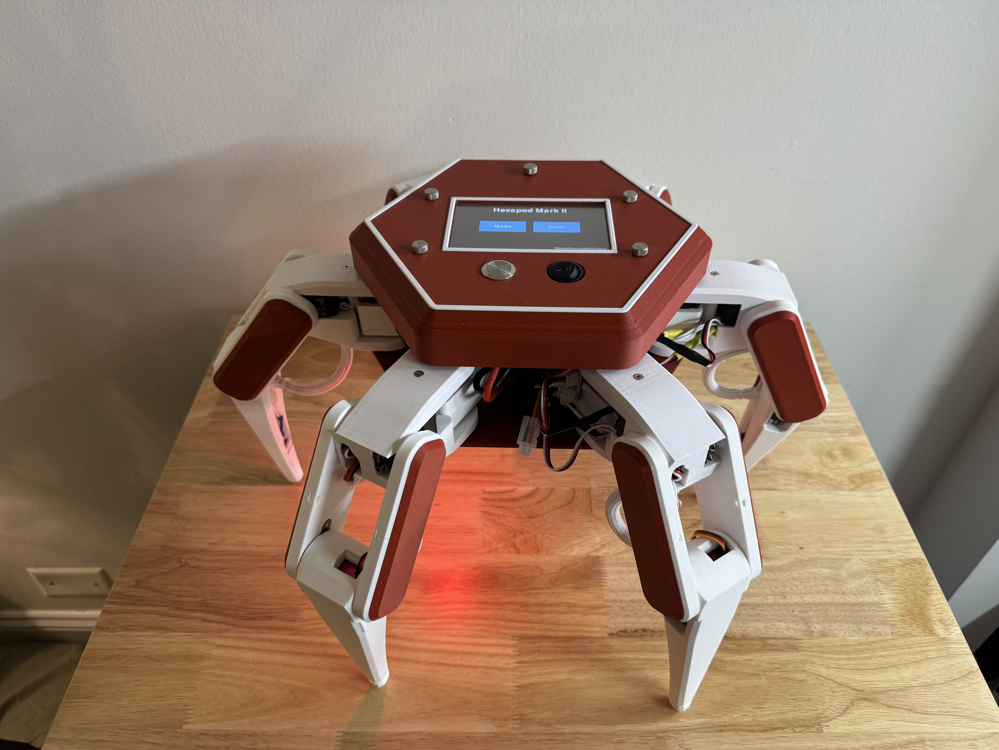
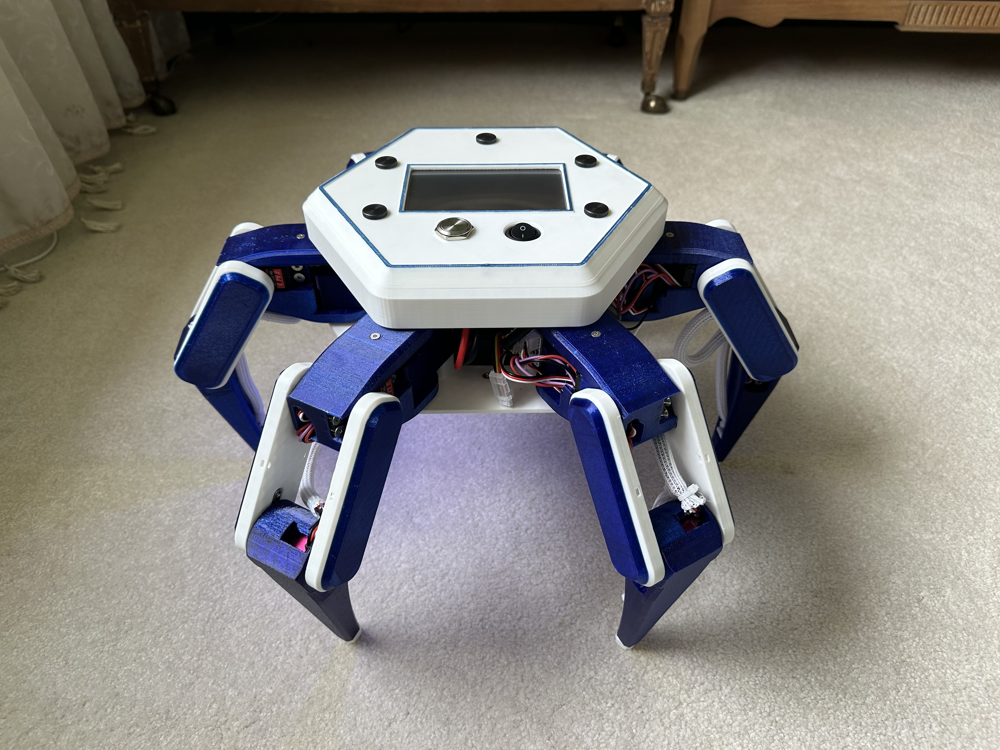
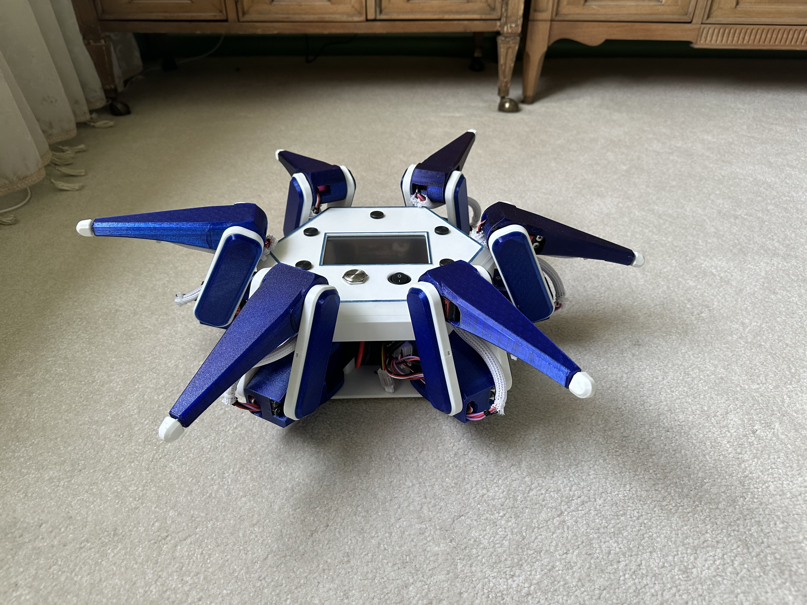
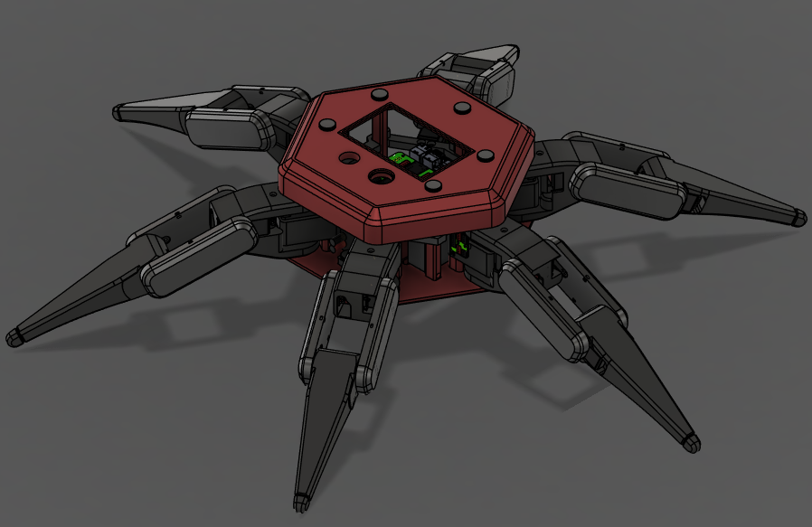
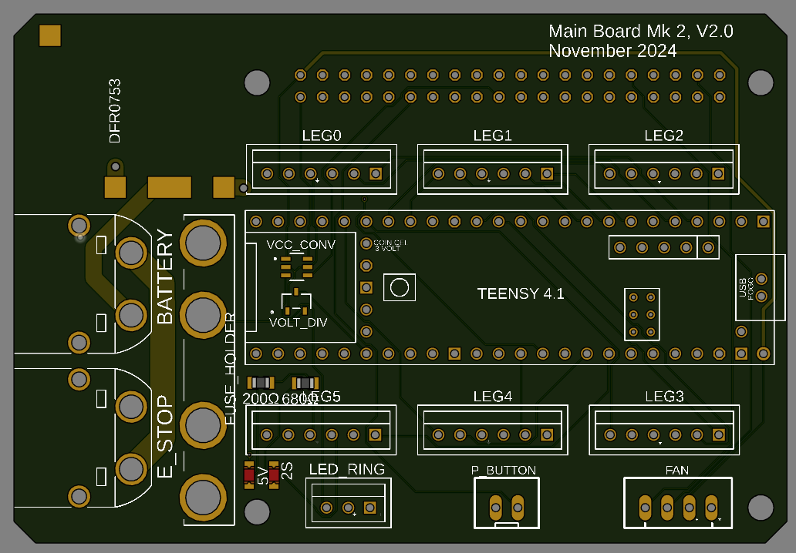
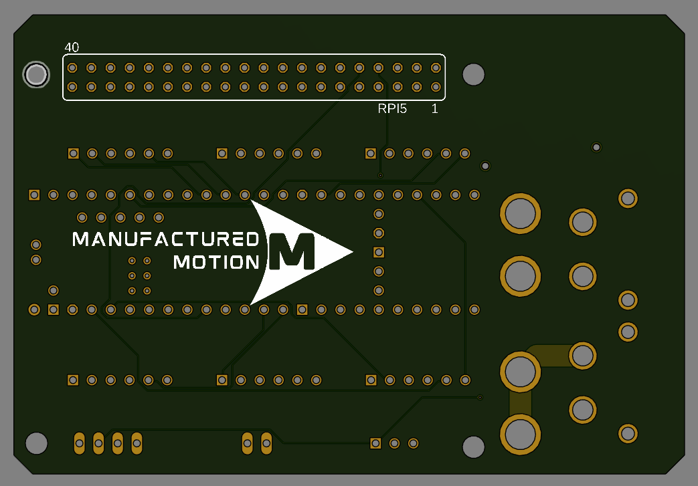

!!! warning "Hex2 Deprecated"
    Hex2 was deprecated in July 2025. While the Manufactured Motion repositories still contain all materials needed to build and control Hex2, it is no longer actively supported. You are welcome to fork the repository to continue development.

    Hex2 lacks many of the quality-of-life improvements and features introduced in Hex3. The two main limitations are:

    - Hobby-grade servos can overheat, limiting continuous runtime to only a few minutes.
    - Maximum payload is only a few pounds, compared to the 50+ pound target for Hex3.

## Overview

This second iteration of the Hexapod design utilizes a Raspberry Pi 5 and Teensy 4.1 for command and control.

Hex2 also introduces a redesigned PCB with key improvements, including separate voltage rails for direct servo power delivery.

A full CAD overhaul was performed to reduce part count and improve modularity, allowing components to be swapped without reprinting large assemblies.

---

## Software Stack

Hex2 transitions to ROS2 on Ubuntu, enabling integration with existing robotics ecosystems such as `joy` and `cmd_vel`, while also supporting custom nodes.

More details on launching ROS2 packages can be found in the Useful Commands section of the wiki.

A key example is the custom Teensy gait node, which parses controller input and sends movement instructions to the Teensy 4.1 in real time.

---

## CAD Model

---

## Electronics

---

## Hex2 Project Glossary

- [3D Models](https://github.com/ManufacturedMotion/Hexapod/tree/main/Hex2_resources/CAD)
- [Bill of Materials](https://github.com/ManufacturedMotion/Hexapod/tree/main/Hex2_resources/BOM)
- [Teensy Code](https://github.com/ManufacturedMotion/Hexapod/tree/main/Hex2/real_time)
- [Raspberry Pi Code](https://github.com/ManufacturedMotion/Hexapod/tree/main/Hex2/non_real_time)
- [Electronics](https://github.com/ManufacturedMotion/Hexapod/tree/main/Hex2_resources/electronics)

---

## License

MIT LICENSE