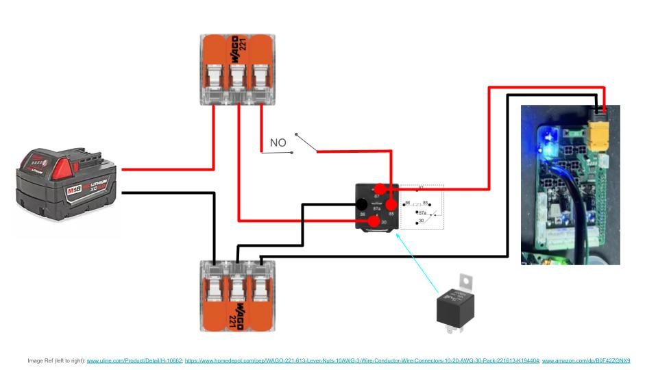
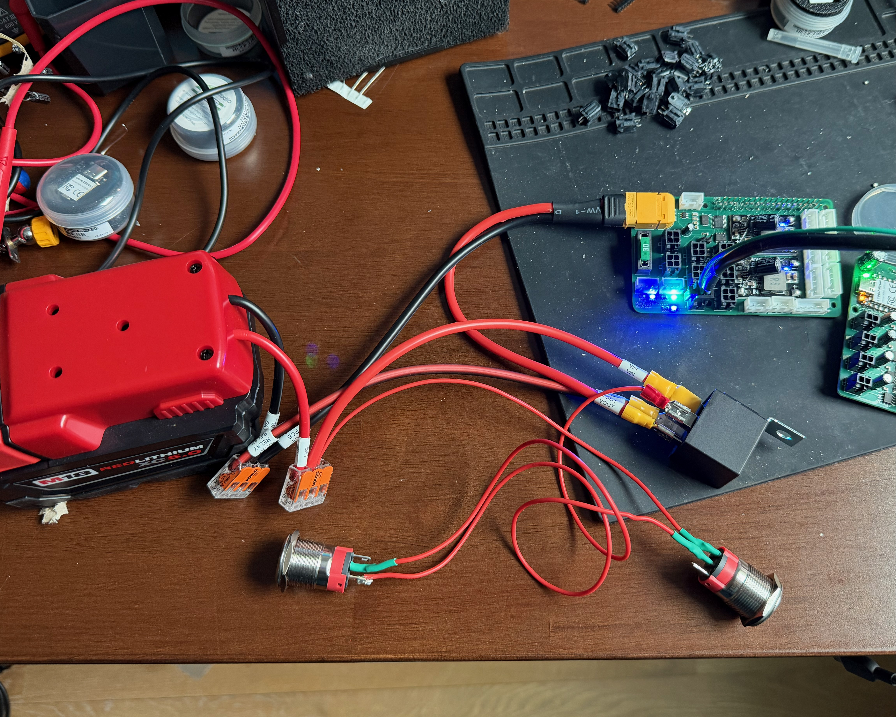
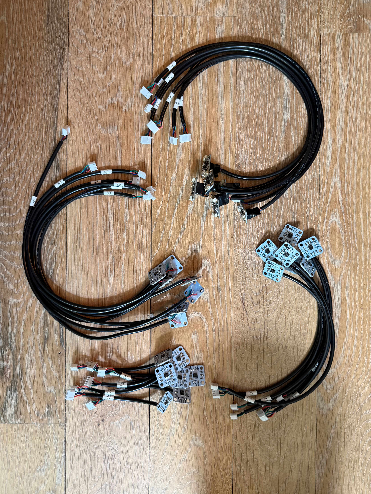
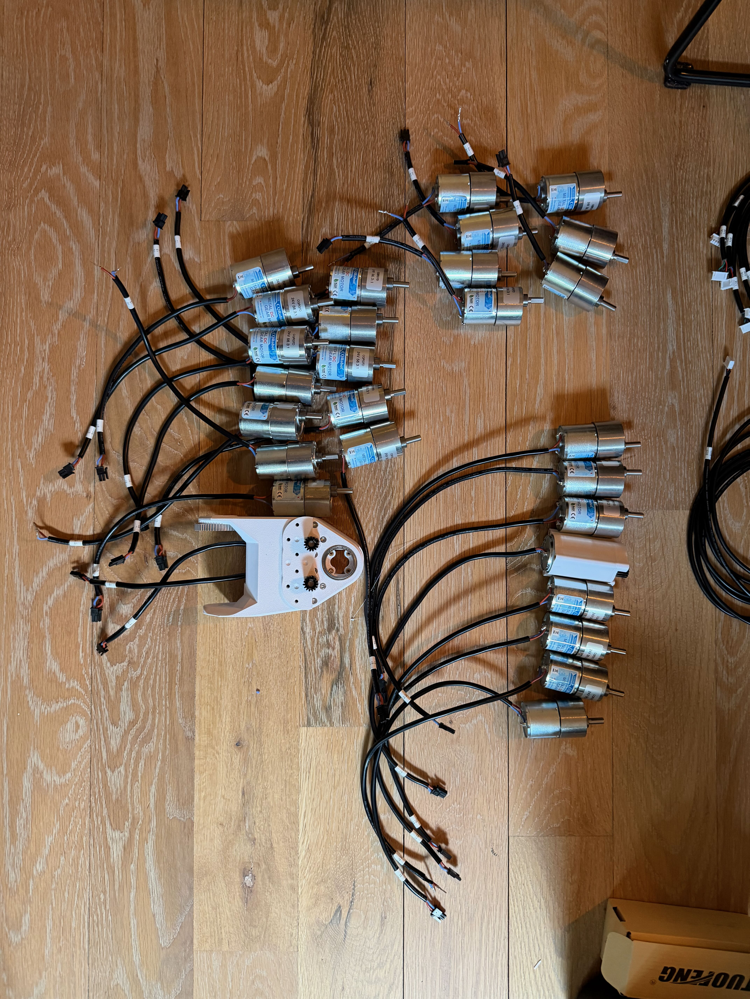
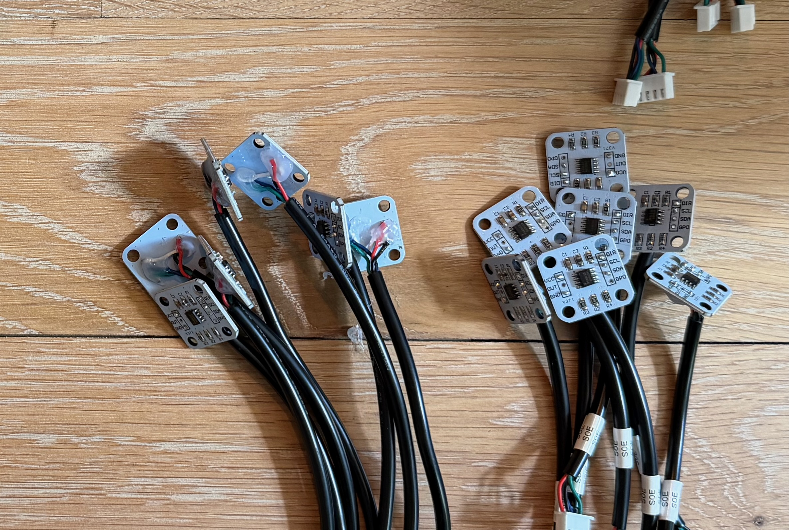
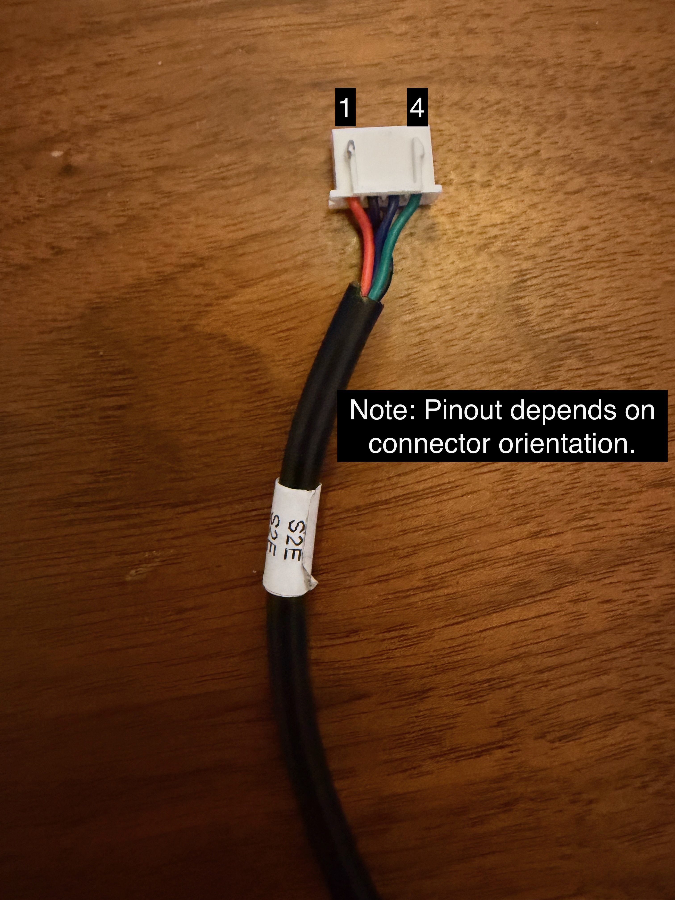

# Electronics Setup

## Power Wiring

The power for the Hexapod comes from a 5Ah Milwaukee M18 battery. Power is sent to the main PCB and distributed from there. A relay handles turning the Hexapod on and off via a latching power switch.

The connections are: 

| Component | Connection |
|-----------|------------|
| M18 Battery (+) | WAGO → Relay Pin 30 and latching switch input |
| M18 Battery (-) | WAGO → Relay Pin 85 and robot ground |
| Latching Switch Input | Battery + |
| Latching Switch Output | Relay Pin 86 |
| Hexapod Power (+) | Relay Pin 87 |
| Hexapod Ground (-) | Battery - |

The JD2914 relay pinout is:

| Relay Pin | Function | Connects To | Wire Color (Recommended) | Notes |
|------------|----------|-------------|--------------------------|-------|
| **30** | Common (COM) | Battery | Red | Main power input from the M18 battery |
| **87** | Normally Open (NO) | Robot power **+** | Red | Connected to Pin 30 when the relay is energized |
| **87a** | Normally Closed (NC) | *Not connected* | — | Leave unused and insulated |
| **85** | Coil (-) | Battery **-** | Black | Relay coil ground |
| **86** | Coil (+) | Output of the latching power switch | Red | Energizes the relay when the switch is ON |

---

## Raspberry Pi Wiring

!!! note
    Due to noise from the buck converters + relay combination, the Raspberry Pi 5 needs to be booted after the Hexapod is powered on. 

This power cycling can be easily handled via the Raspberry Pi 5's built in power button vias. We recommend using right angle headers and wiring in a momentary power button to trigger the restart (Hex3's lid has a hole for a momentary power switch).

Follow [these Raspberry Pi docs](https://www.raspberrypi.com/documentation/computers/raspberry-pi.html#add-your-own-power-button) on adding your own power button.

---

## Wire Lengths

/// html | div.grid

///

| Connection | End 1 Connector | End 2 Connector | Wire Length | Wire Type | Quantity |
|:-----------|:----------------|:----------------|------------:|:----------|---------:|
| S0 Encoder <> Leg PCB | None | 4 Pin JST XH Female Socket Housing | 120 mm | 4 Conductor 24 AWG | 6 |
| S0 Motor <> Leg PCB | None | 2 Pin Molex Microfit 3.0 Plug | 130 mm | 2 Conductor 18 AWG | 6 |
| S1 Encoder <> Leg PCB | None | 4 Pin JST XH Female Socket Housing | 250 mm | 4 Conductor 24 AWG | 6 |
| S1 Motor <> Leg PCB | None | 2 Pin Molex Microfit 3.0 Plug | 265 mm | 2 Conductor 18 AWG | 6 |
| S2 Encoder <> Leg PCB | None | 4 Pin JST XH Female Socket Housing | 405 mm | 4 Conductor 24 AWG | 6 |
| S2 Motor <> Leg PCB | None | 2 Pin Molex Microfit 3.0 Plug | 365 mm | 2 Conductor 18 AWG | 6 |
| Time of Flight (Toe) Sensor <> Leg PCB | 4 Pin JST XH Female Socket Housing | 5 Pin JST XH Female Socket Housing | 450 mm | 4 Conductor 24 AWG | 6 |
| Main PCB <> Leg PCB | 4 Pin Molex Microfit 3.0 Plug | 4 Pin Molex Microfit 3.0 Plug | 185 mm | 2 Conductor 18 AWG + 2 Conductor Twisted Pair 24 AWG | 5 |
| Main PCB <> Leg PCB | 4 Pin Molex Microfit 3.0 Plug | 4 Pin Molex Microfit 3.0 Plug | 250 mm | 2 Conductor 18 AWG + 2 Conductor Twisted Pair 24 AWG | 1* |

*Used for the leg behind the battery connection.

---

## Encoders

!!! note
    The encoder's DIR pin must be grounded. This is done directly on the encoder board with a small jumper wire between DIR and GND — it is separate from the 4 conductor harness below.

If using our 4 conductor wire harnesses (see [Wire Lengths](#wire-lengths) above), we recommend wiring:

| Wire Color | Signal | JST Pin |
|---|---|---|
| Red | VCC | 1 |
| Black | GND | 2 |
| Blue | SCL | 3 | 
| Green | SDA | 4 |

...for consistency with the connector order on the board. 

!!! note
    When soldering the encoder wires directly to the S0/S1/S2 encoder boards, keep the solder joints close to flush with the board. Solder that sits proud can stick up higher than the nearby capacitors, which will prevent the encoder from sitting flush once mounted (see the [Mechanical Assembly](mechanical-assembly.md) note that encoders must be installed fully flush).

## Motors

The polarity of the wiring to the motors does not matter, but you should be consistent with your wiring. The polarity choice will affect [these constants in your config.hpp file](https://github.com/ManufacturedMotion/Hex3/blob/5c3b54bb8905e35a4c63c192355dc47a30cfa154/real_time/xiao_code/lib/HexapodController/src/config.hpp#L79). If you connect the negative terminal of the motor to pin 1 of the Molex connector, you will end up with the following axis inversion values: `{true, false, false}`

## Leg PCB <-> Main PCB Connection Cables 

If using our 4 conductor wire harnesses (see [Wire Lengths](#wire-lengths) above), we recommend wiring:

| Wire Color | Signal | Molex Pin |
|---|---|---|
| Purple | GND | 1 |
| Red | VCC | 2 |
| Black | CAN LOW | 3 | 
| White | CAN HIGH | 4 |
