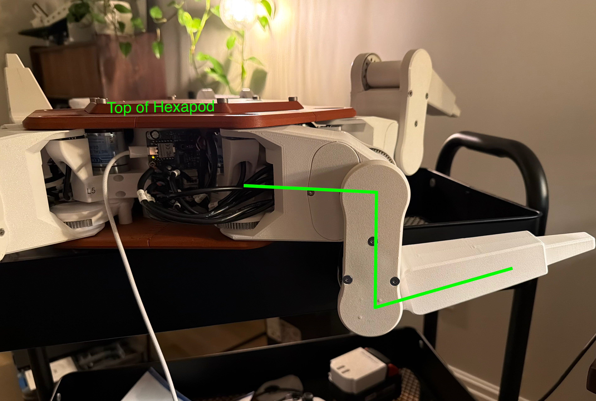

## Wire Lengths

| Connection | End 1 Connector | End 2 Connector | Wire Length | Wire Type | Quantity |
|:-----------|:----------------|:----------------|------------:|:----------|---------:|
| S0 Encoder <> Leg PCB | None | 4 Pin JST XH Female Socket Housing | 120 mm | 4 Conductor 24 AWG | 6 |
| S0 Motor <> Leg PCB | None | 2 Pin Molex Microfit 3.0 Plug | 130 mm | 2 Conductor 18 AWG | 6 |
| S1 Encoder <> Leg PCB | None | 4 Pin JST XH Female Socket Housing | 250 mm | 4 Conductor 24 AWG | 6 |
| S1 Motor <> Leg PCB | None | 2 Pin Molex Microfit 3.0 Plug | 265 mm | 2 Conductor 18 AWG | 6 |
| S2 Encoder <> Leg PCB | None | 4 Pin JST XH Female Socket Housing | 405 mm | 4 Conductor 24 AWG | 6 |
| S2 Motor <> Leg PCB | None | 2 Pin Molex Microfit 3.0 Plug | 365 mm | 2 Conductor 18 AWG | 6 |
| Time of Flight (Toe) Sensor <> Leg PCB | 4 Pin JST XH Female Socket Housing | 5 Pin JST XH Female Socket Housing | 450 mm | 4 Conductor 24 AWG | 6 |
| Main PCB <> Leg PCB | 4 Pin Molex Microfit 3.0 Plug | 4 Pin Molex Microfit 3.0 Plug | 185 mm | 2 Conductor 18 AWG + 2 Conductor Twisted Pair 24 AWG | 5 |
| Main PCB <> Leg PCB | 4 Pin Molex Microfit 3.0 Plug | 4 Pin Molex Microfit 3.0 Plug | 250 mm | 2 Conductor 18 AWG + 2 Conductor Twisted Pair 24 AWG | 1* |

*Used for the leg behind the battery connection.

---

## Leg Calibration

1. Create a user profile in the `config.cpp` file. It should look something like:

    ```cpp
    #ifdef USER
    #define STEP_THRESHOLD 40
    #define FIFO_IDLE_THRESHOLD 100
    #define ZERO_POINTS {                    \
        {0.547631 + CALIBRATION_OFFSET_A0,   \
        -0.836020 + CALIBRATION_OFFSET_A1,  \
        2.787243 + CALIBRATION_OFFSET_A2},  \
        {0.0 + CALIBRATION_OFFSET_A0,   \
        0.0 + CALIBRATION_OFFSET_A1,  \
        0.0 + CALIBRATION_OFFSET_A2}, \
        {0.0 + CALIBRATION_OFFSET_A0,   \
        0.0 + CALIBRATION_OFFSET_A1,   \
        0.0 + CALIBRATION_OFFSET_A2},  \
        {0.0 + CALIBRATION_OFFSET_A0,  \
        0.0 + CALIBRATION_OFFSET_A1,   \
        0.0 + CALIBRATION_OFFSET_A2},  \
        {0.0 + CALIBRATION_OFFSET_A0,   \
        0.0 + CALIBRATION_OFFSET_A1,  \
        0.0 + CALIBRATION_OFFSET_A2},  \
        {0.0 + CALIBRATION_OFFSET_A0,   \
        0.0 + CALIBRATION_OFFSET_A1,  \
        0.0 + CALIBRATION_OFFSET_A2}, \
    }

    ...

    #endif
    ```

2. To calibrate your legs, set both the config values and calibration offsets to 0.0:

    ```cpp
    #define ZERO_POINTS {                    \
        {0.0 + 0.0,   \
        0.0 + 0.0,  \
        0.0 + 0.0},  \
        {0.0 + 0.0,   \
        0.0 + 0.0,  \
        0.0 + 0.0}, \
        {0.0 + 0.0,   \
        0.0 + 0.0,   \
        0.0 + 0.0},  \
        {0.0 + 0.0,  \
        0.0 + 0.0,   \
        0.0 + 0.0},  \
        {0.0 + 0.0,   \
        0.0 + 0.0,  \
        0.0 + 0.0},  \
        {0.0 + 0.0,   \
        0.0 + 0.0,  \
        0.0 + 0.0}, \
    }
    ```

3. Turn off the hexapod and move the leg to the calibration position and plug in the Xiao RP2350 on the mainboard.

    

    1. S1 should be parallel with the side panel of the hexapod.
    2. S2 should be as far down as it can go. The 3 wires going into S1 must be laid out flush (the distance between S1 and S2 is exactly 1 wire diameter).
    3. S3 should be as far up as it can go (the distance between S2 and S3 is exactly 1 wire diameter).

4. Upload main.cpp and turn on the serial monitor. You should see a value like this:

    ```bash
    {"Joint": {"pos": [0.547631, -0.836020, 2.787243], "vel": [0.000049, 0.006216, 0.000052], "acc": [-0.001082, 4.619407, -0.000955], "duty": [80.000000, -80.000000, -80.000000]}, "voltage": 0.730000, "toe": 0.000000}
    ```

5. Add the code to the leg you are calibrating. For example, if we were calibrating Leg0:

    ```cpp
     #define ZERO_POINTS {                    \
        {0.547631 + CALIBRATION_OFFSET_A0,   \
        -0.836020 + CALIBRATION_OFFSET_A1,  \
         2.787243 + CALIBRATION_OFFSET_A2},  \
        {0.0 + 0.0,   \
        0.0 + 0.0,  \
        0.0 + 0.0}, \
        {0.0 + 0.0,   \
        0.0 + 0.0,   \
        0.0 + 0.0},  \
        {0.0 + 0.0,  \
        0.0 + 0.0,   \
        0.0 + 0.0},  \
        {0.0 + 0.0,   \
        0.0 + 0.0,  \
        0.0 + 0.0},  \
        {0.0 + 0.0,   \
        0.0 + 0.0,  \
        0.0 + 0.0}, \
    }
    ```

6. Upload the code to the leg and make sure it is in a standing position. (Confirm in `USER_CONFIG.HPP` that you set the correct `LEG_NUMBER`).

7. Repeat for all 6 legs.