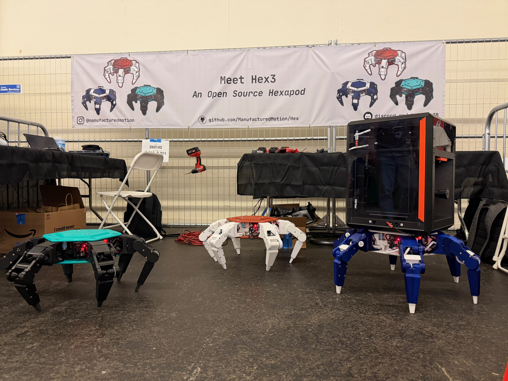
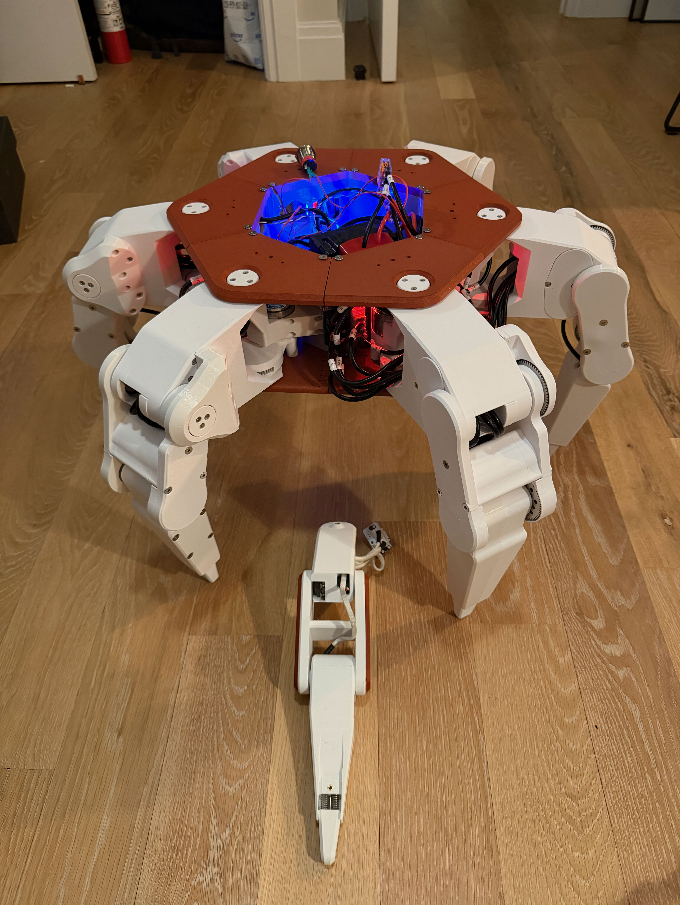
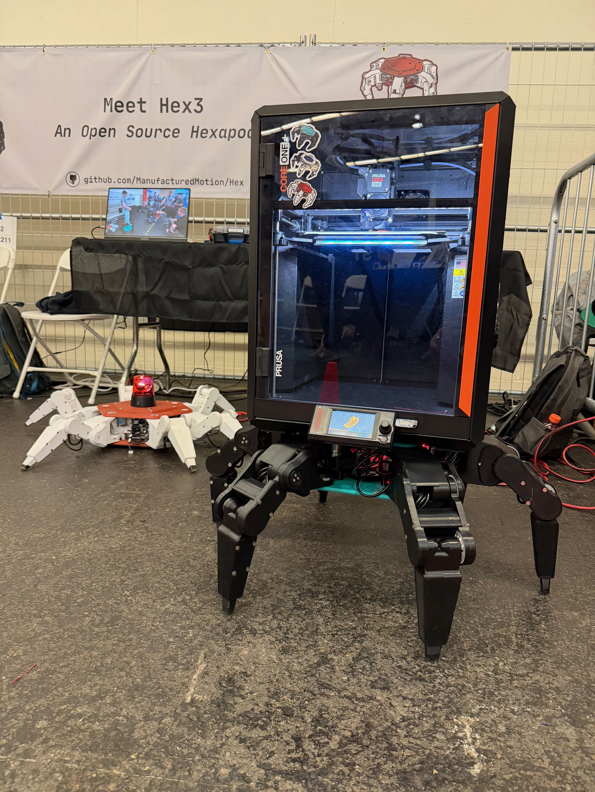

# Hex 3

## Overview

Hex3 is the third generation of our Hexapod platform. Highlights of this generation:

- 10kg (~22lb) payload capacity
- Drivable via Xbox controller
- Fully 3D printed body and legs
- 18 degrees-of-freedom (DOF) design with 3 DOF per leg
- Custom low-cost servos made using DC gear motors and AS5600 magnetic encoders (as opposed to the hobby-servos that were prone to overheating on [Hex2](../Hex2/index.md).)
- Spring loaded toe with position sensor to measure force applied by each leg
- Three-level control to follow user commands
    - High level whole hexapod gait
    - Model predictive control enabling each leg to apply a directionally controlled force of a specified magnitude
    - Each axis controlled using PID with feedforward control based on current loads and requested accelerations for accurate path following
- Custom PCBs for Pi and leg connectivity
- Standard hardware holding the Hexapod together
- Modular compute architecture 
- Deterministic real time compute provided by Xiao RP2350s
- ROS2 on Raspberry Pi 5 to allow easy build in to existing robotic development platforms

Price point: ~$2,000 USD. 

!!! note
    The Hex3 platform is not being actively developed against, and is instead considered "steady-state" for a release. If you have modifications or features you would like to add, please either make a PR and request a review in our [Hex Discord](https://discord.gg/v3bbvRtFUr), or publish a fork of this project. 

/// html | div.grid

///

---

## Software Stack

Command and control still runs on a Raspberry Pi 5, but each leg now carries its own [Seeed Xiao RP2350](https://www.seeedstudio.com/Seeed-Studio-XIAO-RP2350-p-5944.html) microcontroller instead of a single central Teensy. The Pi talks to all six leg controllers over a shared CAN bus, so each leg handles its own axis control, encoder feedback, and toe (foot contact) sensing locally, then reports state back over CAN.

Hex3 runs ROS2 inside a Docker container on the Pi. Xbox controller input flows through a small pipeline of nodes:

`control` (xbox input) &rarr; `tripod_gait` &rarr; `inverse_kinematics` &rarr; `can` (dispatches to each leg's Xiao over CAN).

See the [Common Commands](common-commands.md) page for how to launch this stack and the individual nodes, and the [Raspberry Pi Setup](raspberry-pi.md) page for configuring the Pi itself.

Each leg's real-time control loop (motor PID, encoder reads, toe sensing, and CAN messaging) runs as firmware on that leg's Xiao RP2350 — see [Real-Time Firmware](firmware-setup.md) for building, flashing, and calibrating it, and [Electronics Setup](electronics-setup.md) for wiring.

Fully 3D printed body and legs — see [3D Printing](3d-printing.md) for print recommendations.

---

## Project Glossary

- [Bill of Materials](https://docs.google.com/spreadsheets/d/1jHR1j3dNIgRCcadYxqtaftRhhn8tEC1XY8og_EQwXEU/edit?gid=0#gid=0)
- [CAD Models](https://github.com/ManufacturedMotion/Hex/tree/main/Hex3_resources/cad)
- [Electronics](https://github.com/ManufacturedMotion/Hex/tree/main/Hex3_resources/electronics)
- [Raspberry Pi / ROS2 Code](https://github.com/ManufacturedMotion/Hex3/tree/main/non_real_time)
- [Real-Time (Xiao) Firmware](https://github.com/ManufacturedMotion/Hex3/tree/main/real_time)

---

## Potential Improvements

The following items are not planned prior to the release of Hex3, but would likely be beneficial for someone to tackle in the future:

### CAD
- S1 to have replaceable magnet holder (similar to S2/S3)
    - Make the entire hexapod a few mm taller to account for this
- S0 gear cover prevent breakage
- Redesign S3 to allow for toe replacement without needing to fully disassemble S2 + S3
- S1 gear cover thicker to allow for M18 screws
- Increase S2 thickness to allow for more S3 motor pinout clearance
- Beef up S2 due to consistent breaking

### Non-Real Time Code
- Vibrate the controller on low battery
- Remove outdated/unnecessary code
- Add in additional macros

### Real Time Code
- Configure toe ToF sensors + integrate them into walking gaits
- Dynamic gait adjustment based on payload

### Main PCB
- Switch over to more powerful Buck Converter, instead of two smaller buck converters (liklely [this buck converter](https://www.digikey.com/en/products/detail/tdk-lambda/I3A4W005A150V-001-R/7321112?gclsrc=aw.ds&gad_source=1&gad_campaignid=22470346989&gbraid=0AAAAADrbLljGVHiysrjQKta-M4nAum4GF))
- Capacitors on input to Buck Converter

--- 

## License

[GNU General Public License v3.0](https://github.com/ManufacturedMotion/Hex3/blob/main/LICENSE)
