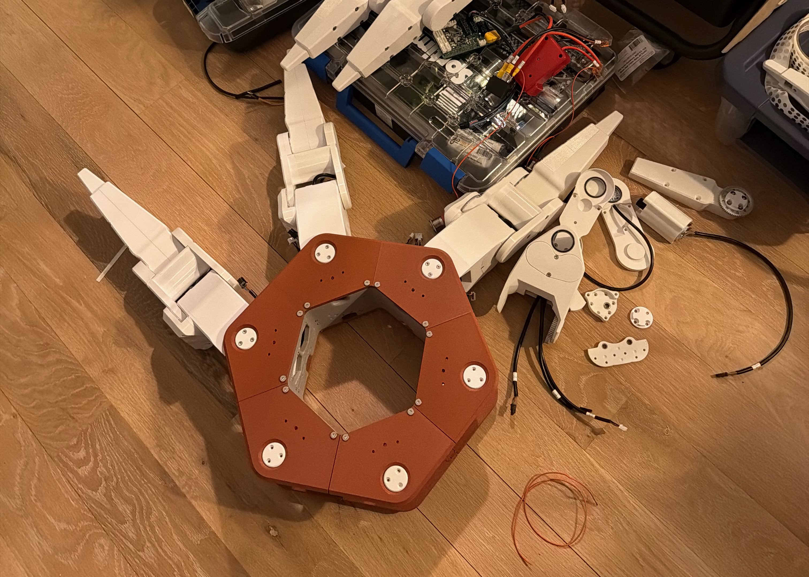
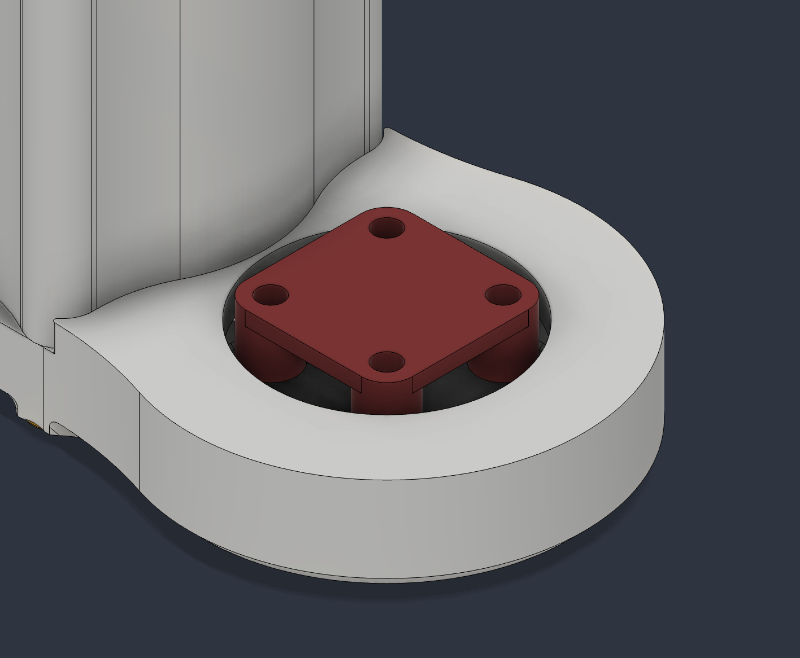
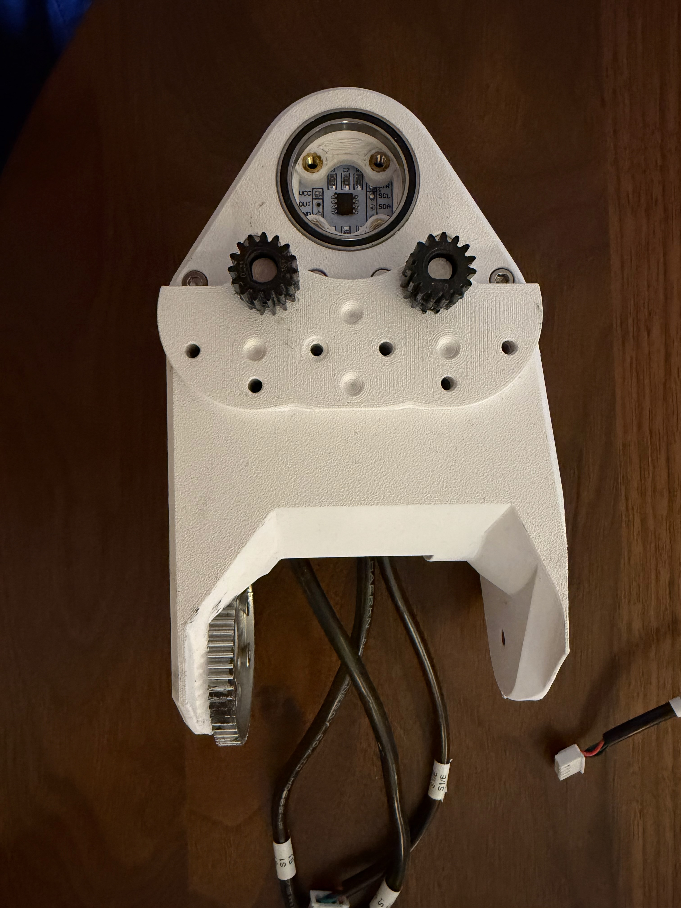
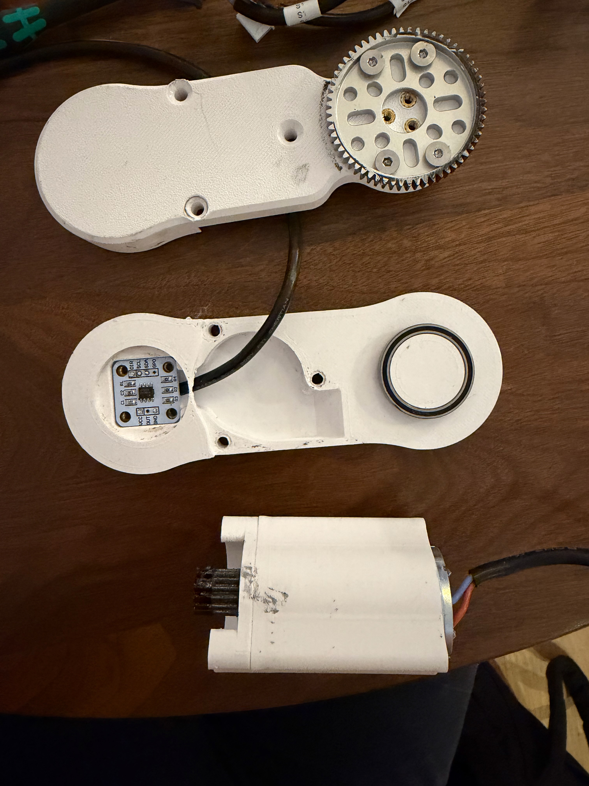
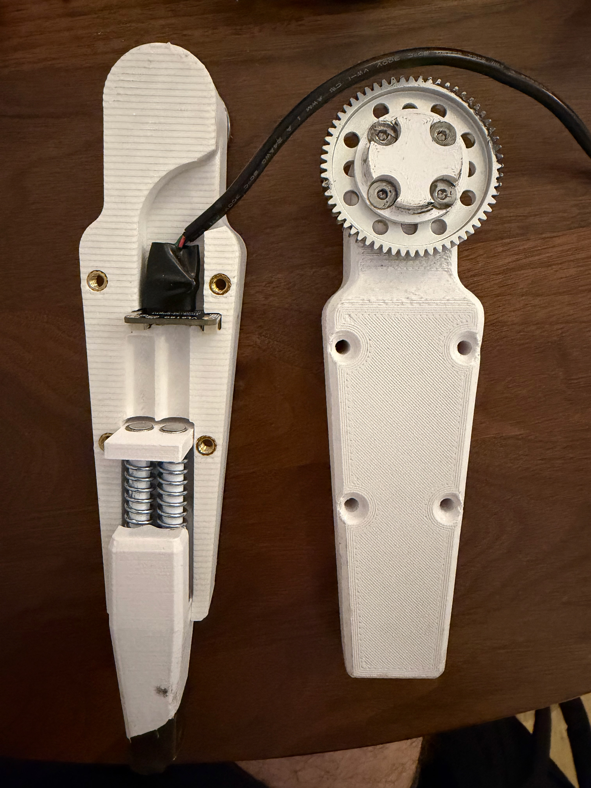
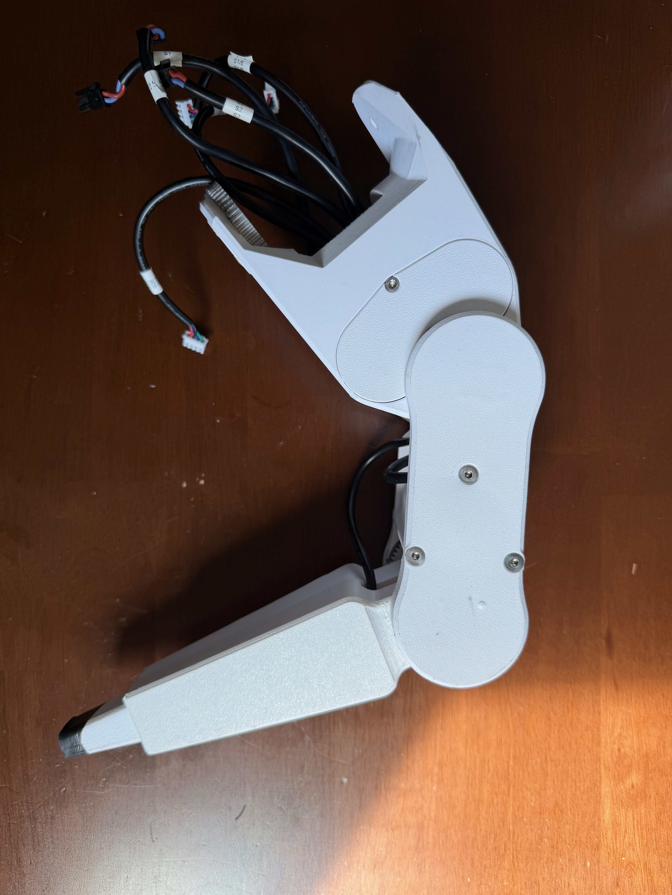
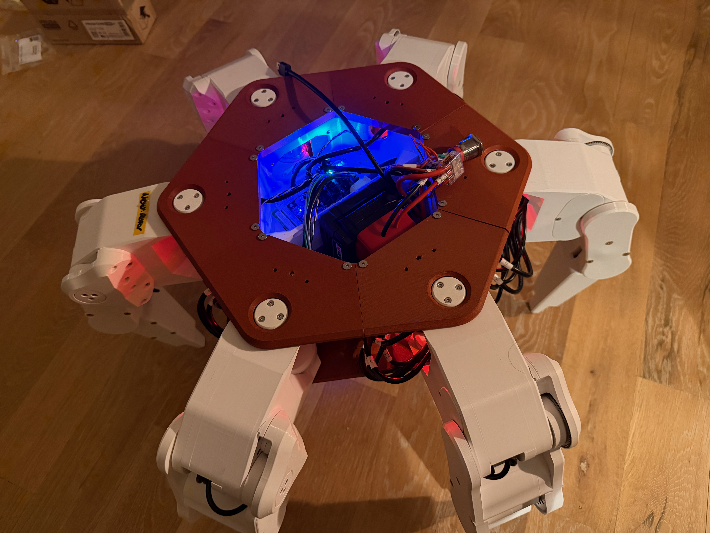
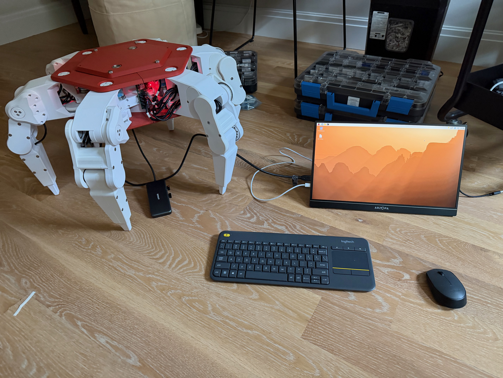

# Assembly Steps

!!! note
    - This SOP assumes you have all of the necessary parts 3D printed (refer to the [BOM](https://docs.google.com/spreadsheets/d/1jHR1j3dNIgRCcadYxqtaftRhhn8tEC1XY8og_EQwXEU/edit?usp=sharing) and use the [Print Recommendations](3d-printing.md))
    - Parts might look slightly different from the images / CAD screenshots here. Always use the newest version available on the Github.

---
## Leg Assembly

It is up to you how you would like to batch the parts needed for a leg assembly. You can add the heatsets to one part at a time, all the parts for a leg, or all the parts for all the legs. These instructions cover assembly on a per leg basis, so we will prep all the parts for a single leg at once.

!!! note
    Refer to the CAD if any screw, heatset, or other placement is unclear. All hardware is included in the Fusion360 assembly.

### Part Preparation

1. Install all of the M3 heatset inserts:

    1. [S0] 4x for the encoder mount.
    1. [S1] 4x for the encoder mount.
    1. [S1] 6x for the base upper and base lower connections.
    1. [S1] 2x for the motor cover.
    1. [S2] 3x onto the S2 gear side.
    1. [S2] 4x for the encoder mount.
    1. [S2] 2x for the encoder magnet mount.
    1. [S3] 2x for the encoder magnet mount.

1. Install all of the M4 inserts:

    1. [S1] 4x for the hub gear connection.
    1. [S2] 4x for the hub gear connection.
    1. [S2] 6x for the long S2 connector.
    1. [S3] 4x for the hub gear connection.
    1. [S3] 4x on the S3 gear side to connect the pieces together.
    1. [S3] 2x in the toe piece.

1. Press fit the encoder magnets (note: these must be perfectly flush, and not installed at an angle):

    1. [S1] 1x directly on the part.
    1. [S2] 1x on the removable magnet holder.
    1. [S3] 1x on the removable magnet holder.
    1. Install the S2 and S3 magnet holders onto those parts.

1. Press fit the small motor bearings (6mmx10mmx3mm). These bearings get installed on any parts that mate with the shaft of a motor:

    1. [S0] 1x installed on the S0 gear cover. 
    1. [S1] 2x installed on the S1 motor bearing holder.
    1. [S2] 1x installed on the S2 short connector.

1. Press fit the large bearings (25x32x4mm).

    1. [S1] 2x installed in S1.
    1. [S1] 1x installed in the S1 motor bearing mount.
    1. [S2] 1x installed on the S2 bearing side.
    1. [S2] 1x installed on the S2 gear side.

1. Install the encoders using the [encoder helper tool](https://github.com/ManufacturedMotion/Hex/tree/main/Hex3_resources/cad), ensuring that they are fully flush against the part. Be careful not to scrape the PCB when installing. Screws should also be removed from the encoder once mounted.

    

    1. [S0] 1x encoder installed.
    1. [S1] 1x encoder installed with cover (2 screws remain through the cover).
    1. [S2] 1x encoder installed bearing side.

### Assembly

!!! note
    The grub screw placement on the 15-tooth gear (this is the small one!) is critical, and varies per motor, so please refer to the CAD for confirmation.
    We also recommend applying some Blue Loctite to the grub screw when attaching the gear to the motor shaft.

#### S0 Assembly

1. Attach the motor to S0 using two M3x08 screws.
1. Add in the S0 gear cover spacer.
1. Add the 15 tooth gear to the S0 motor shaft with the **grub screw closest to the motor**.
1. Attach the S0 gear cover with two M3x18 screws.
1. Leave the rest of the assembly to a later part.

#### S1 Assembly

1. Install the two motors into S1, only using the 3 screws closest to the encoder on each motor. Route the wires out the back of S1.
1. Route the encoder wire out the back of S1, through the two motors.
1. Add in the S1 motor bearing holder.
1. Add a 15 tooth gear on each S1 motor shaft with the grub screw **closer to motor base**.
1. Install the hub gear using four M4 screws.
1. Install the S1 motor cover using two M3 screws.
1. Leave the rest of the assembly to a later part.

#### S2 Assembly

1. Install the S2 motor through both the S2 short and S2 long pieces. Connect using 6 M3x08 screws.
1. Add the 15 tooth gear to the S2 motor shaft with the grub screw **further** from the motor.
1. Install the hub gear using 4x M4 screws.
1. Leave the rest of the assembly to a later part.

#### S3 Assembly

1. Install the hub gear with the S3 gear mount.
1. Combine the spring, spring aligner, and toe together with M4x60 screws.
1. Place the toe assembly into S3. 
1. Optionally add in the toe distance time-of-flight sensor.
  - Reminder -- this is an experimental component! The TOF sensor has not been fully implemented in software at the time of writing this documentation. 
1. Close the assembly using four M4 screws (note: two are M4x30, two are M4x35).
1. Leave the rest of the assembly to a later part.

#### Leg Assembly

1. Attach the S2 gear side into S1 by inserting the bearing connection piece from S2 into S1.
1. Lock the S2 gear side and S1 together by adding in the S2 motor bearing mount and S1 motor gear holder.
1. Connect the S2 bearing side and S2 motor assembly using 3 M4 screws.
1. Sandwich together the S1/S2 gear side assembly, the S3 assembly, and the S2 + motor assembly. These should all be press fit together, and locked together with 3 M4 Screws.
1. The leg assembly is complete! Follow the steps below to attach it to S0 and the base.

## Base Assembly

### Part Preparation

1. Attach all M3 and M4 heatsets according to the Fusion360 Assembly.
1. Press fit all the bearings into the leg flats, and install the S1 bearing holder into each.

### Assembly

1. Attach each of the six leg PCBs to a side of the hexapod base.
1. Attach S0 using the 2-4 M4 screws on the leg flats.
1. Install the Relay and PCB mount + PCB guard from the [Electronics Assembly](electronics-setup.md).
1. Install the HDMI connector and USB connector onto the base lower.
1. Attach the base lower using M4 screws. The long M3 screws should go through the base lower, and into the S0 attachment.
1. Carefully insert the leg assemblies into the sides of the hexapod, meshing each leg's S1 hub gear with the S0 driven gear (refer to the CAD if gear alignment is unclear), and taking care to align the 3 M3 screws on the base upper and base lower.

    

1. Install the Raspberry Pi and wire in the power switches onto the base upper. Attach the base upper in place.
1. Assembly is complete!

