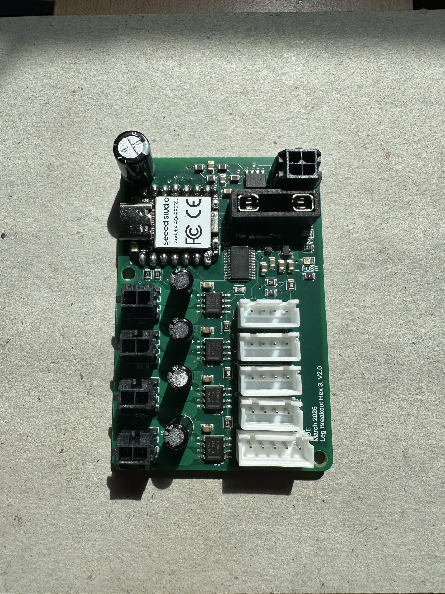
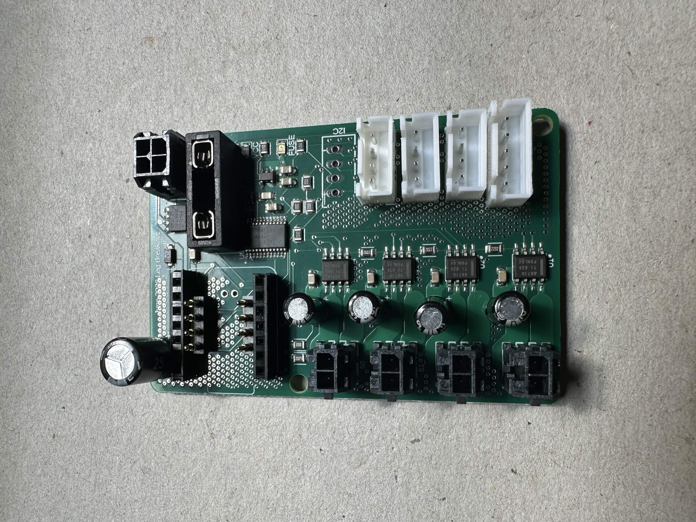
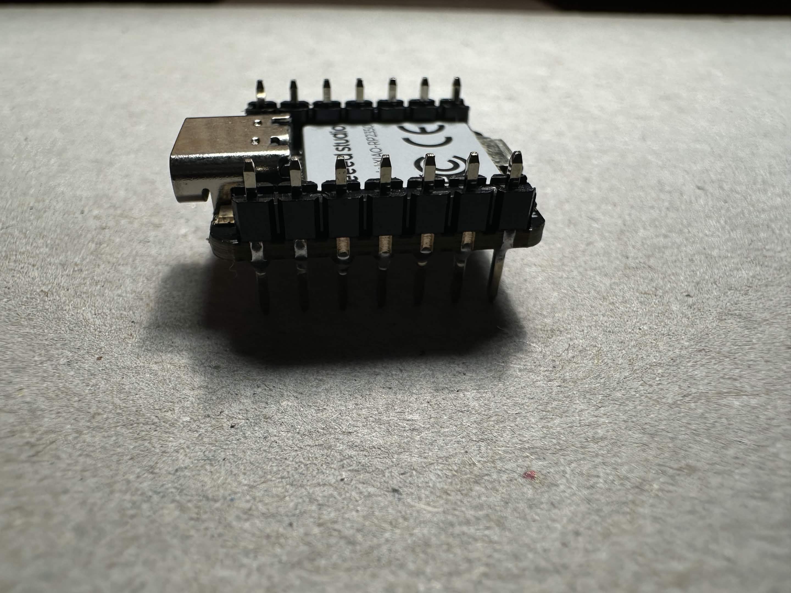
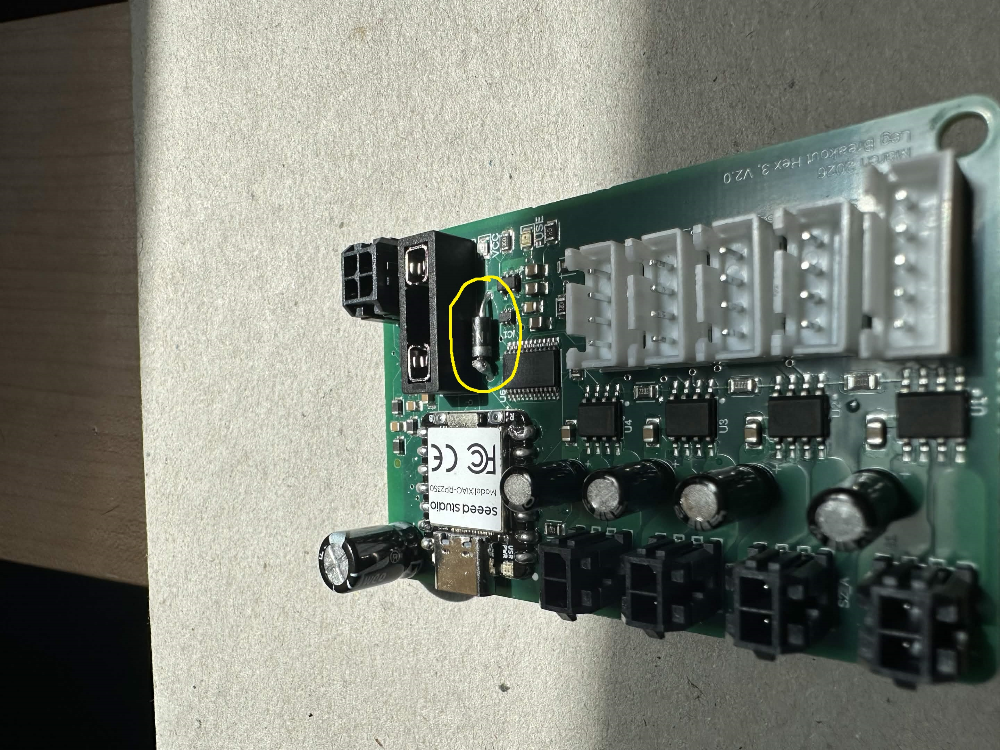
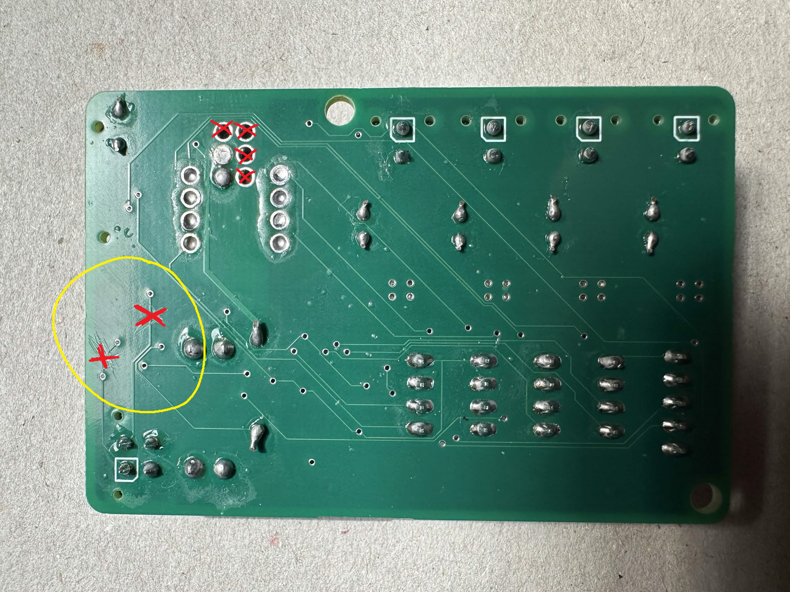
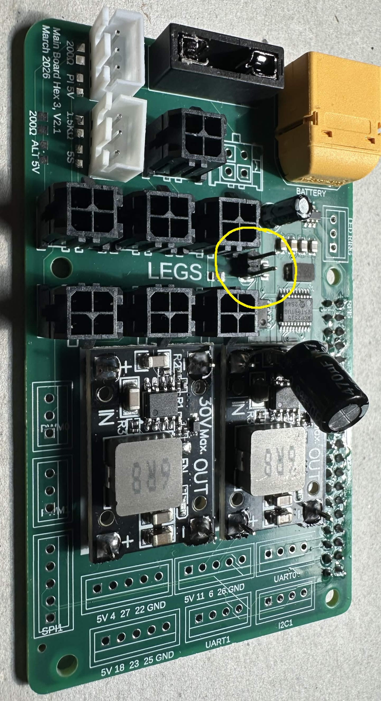
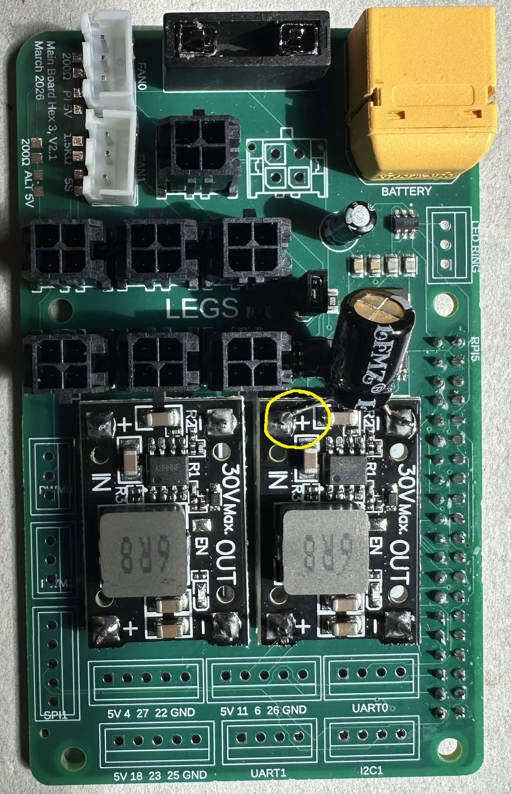

# PCB Assembly

This page is intended to collect assembly instructions for the Hex3 printed circuit boards, including the two leg PCB revisions and the main PCB.

## Tools and Components

- Soldering iron and soldering accessories
- Flux and solder
- Multimeter for continuity and polarity checks
- PCB holder or vise (recommended)
- ESD-safe handling practices (recommended)
- Relevant parts, BOM and board revision documentation

## Leg PCB

There are two versions of the Leg PCB available for building the Hex3 platform: **V2.0** and **V3.2**. Both versions are fully functional and can be used to build a complete Hex3 platform. The main differences are in **assembly method, thermal management, PCB cost, and XIAO RP2350 reusability.**

V2.0 is the simpler and more cost-effective design, with components that are straightforward to assemble by hand. V3.2 is a more refined design focused on improved thermal performance and easier XIAO RP2350 replacement/reuse, but comes with increased PCB cost and some additional assembly considerations.

The following sections summarize the main pros and cons of each version.

Leg V2.0:
- through hole diode
  - to be soldered by hand
- DRV8871 motor driver chips do not get additional cooling
  - external heat sinks can still be applied, but the PCB layout and design was not focused on heat dissipation
- XIAO RP2350 soldered directly to the PCB
  - cannot repurpose / reuse the XIAO board 



Leg V3.2:
- SMT diode
  - less hand soldering required, but you have to add this part to your ASM part list when placing the order
- Design has heavy emphasis on increased cooling for the DRV8871 motor driver chips
  - 2 oz internal copper pours (this increases the price quite a bit!)
  - via stitching for GND plane 
- POGO pin option for XIAO RP2350 board
  - can re-use the XIAO on other projects if desired (no longer soldered directly to the PCB)
  - POGO pin spacing is sensitive -- you need specific male/female header pins to get a good distance for the POGO compression



### Parts List (for 1 leg PCB)
- 1x Xiao RP2350 (no headers attached)
- 1x 3557 Fuse block
- 3x 4 Pin JST Board Connector
  - grab a 4th 4 Pin JST if you will use the extra I2C connection! (this is an optional breakout connection. Our current software does not require this to be connected)
- 1x 5 Pin JST Board Connector
- 1x 4 Pin Molex Board Connector
- 4x 2 Pin Molex Board Connector
- 4x 22uF Radial Capacitor
- 1x 470uF Radial Capacitor
- 1x Leg PCB (V2.0 OR V3.2)
  - V2.0:
    - 1x 1N5819 Diode
  - V3.2:
    - 2x 4 Pin POGO Connector (Optional)
    - 2x 7 Pin Short Male Header Pin (Optional)
    - 2x 7 Pin Short Female Header Pin (Optional)

### Recommended Assembly Order

1. We have found it is easiest to start with the Xiao RP2350. If you are using V3.2 of our leg PCB you can opt to use header pins for this connection. V2.0 does not have header pin support
  - surface mounted Xiao suggestions
    - we have had good success by starting with the top pins on the Xiao. Pick any two diagonal pins, and solder these joints with a small amount of solder. Be sure to visually inspect the top pins and the alignment with the PCB's solder pads such that each side of the Xiao is evenly spaced, and all pins are centered.
    - once you have two connections on the top, flip the PCB over. Inspect the through holes on the bottom of the PCB, and make sure the solder pads on the bottom of the Xiao are centered to these holes. If the holes are not centered, flip the board. Heat one corner of the Xiao to loosen it, and gently apply a force to rotate it. Repeat until the holes are centered with the pads on the bottom of the Xiao.
    - once the bottom holes are aligned, you may now solder all of the pins on the top of the Xiao board
    - once the top is finished, move to the bottom. For these connections we found it is best to use a thin soldering iron tip, and apply heat to the hole and Xiao SMT pad at the same time. Once the copper has had time to heat up, fill the hole with solder, and let the soldering iron remain in the solder for a bit to ensure all solder & copper is warm. Remove the soldering iron and make sure the hole was not overfilled, and there are no shorts to the neighboring holes
  - Header pin Xiao suggestions
    - first solder the female header pins to the PCB
    - then solder the male header pins to the Xiao board
      - if you are using the header pins and pogo pins from our Hex3 BOM, we suggest soldering the male pins to the Xiao in a unique fashion, to ensure the pogo pins make solid contact with the pads on the bottom of the Xiao
      - instead of having the Xiao rest on top of the male header pins, insert the pins through the top of the Xiao. (see picture below)
      
    - place the pogo pins on the PCB, and then plug the Xiao into the female header pins. Inspect the alignment of the tip of the pogo pins and the pads on the bottom of the Xiao. If the alignment is good, solder the pogos to the PCB
1.A. If you are using **V3.2 of the board you may skip this step**, as the diode is now SMT and part of the PCB ASM. If you are using **V2.0, solder the diode to the board now. The cathode of the diode should be on the side closer to the Xiao**

2. Solder the 3557 fuse block to the PCB. **Be sure to hold the soldering iron to the pins of the block for long enough such that an adequate amount of heat builds up before applying your solder**
3. JSTS
  - solder the 4 pin JSTs for the encoders
  - optionally, you may solder a 4th JST to the I2C breakout connection
  - solder the 5 pin JST for the toe sensor
4. molex
  - solder the 4 pin Molex for the main power supply / canbus connection with the main PCB
  - solder the 2 pin Molex connectors for the motors
5. capacitors
  - solder the 22uF capacitors for the motor circuits. **Be sure to follow the correct polarity when placing the capacitors! The cathode of the 22uF capacitors should face towards the 2 pin Molex connectors**
  - solder the 470uF capacitor for the Xiao. **Be sure to follow the correct polarity when placing the capacitors!**
    - **for V2.0 the cathode faces towards the fuse block / 4 pin Molex connector**
    - **for V3.2 we changed the alignment, so all capacitors share the same orientation. The cathode for the 470uF capacitor on V3.2 should face towards the Xiao USB**

### Special Leg PCB Version Differences (DO NOT SKIP THIS!!)

#### For users with leg PCB V2.0:
- the traces for the split termination canbus will need to be cut! See the below image and cut the traces in the same location (these traces are on the bottom of the PCB)


#### For users with leg PCB V3.2:
- there is a required software update to account for the new design's connector positions
- please make the following updates to our [leg.cpp](https://github.com/ManufacturedMotion/Hex3/blob/main/real_time/xiao_code/lib/HexapodController/src/leg.cpp) file before uploading to your Xiao boards
  
`Line 53`
```
  -  axes[0].link(D8, D10, 5, mux);
  +  axes[0].link(D17, D18, 7, mux);
```
`Line 55`
```
  -  axes[2].link(D17, D18, 7, mux);
  +  axes[2].link(D8, D10, 5, mux);
```

**your file should look like this after making the updates:**
```
    axes[0].link(D17, D18, 7, mux);
    axes[1].link(D11, D12, D15, D16, 6, mux);
    axes[2].link(D8, D10, 5, mux);
```

### Verification Checks

- Check for solder bridges, cold joints, or misaligned components.
- Verify connector orientation and polarity before powering the board.
- Don't forget to insert a mini blade fuse into the fuse block before your poweron test! For the leg board we are using 10A fuses.
- We suggest connecting each leg board to a power supply (one at a time) and confirming the LEDs and Xiao operate properly prior to testing connection with the main PCB.
- Don't forget to trim the extra length of the legs on the through hole radial capacitors to prevent any shorted connections!

<u>Repeat the above instructions 5 more times so you have a total of 6 leg PCBs!</u>

## Main PCB

### Parts List

- 1x 3557 Fuse Block
- 1x 10uF Radial Capacitor
- 1x 470uF Radial Capacitor
- 1x XT60 Board Connector
- 1x 2 Pin Male Header Pin
- 1x 2 by 40 Female Header Pin for Raspberry Pi
- 2x DC-DC Buck Converter
- 6x 4 Pin Molex Board Connector
  - we actually have solder connections for up to 8x 4 Pin Molex Board Connectors! Since it is a shared canbus and power connection, you can solder your 6 to any of the connection points. You can also choose to solder the other breakouts and update the software to use 8 legs!
- 2x 3 Pin JST Board Connectors
- Optional JST Breakouts
  - we included optional breakouts for the following Pi connections:
    - 1x 3 Pin JST - LED Ring 
    - 1x 3 Pin JST - PWM0
    - 1x 3 Pin JST - PWM1
    - 3x 4 Pin JST
      - UART0
      - UART1
      - I2C
    - 4x 5 Pin JST (numbered pins refer to Pi GPIO pins)
      - 5V, 4, 27, 22, GND
      - 5V, 11, 6, 26, GND
      - 5V, 18, 23, 25, GND
      - SPI1 

### Recommended Assembly Order

1. Solder the XT60 Connector to the PCB. **Be sure to hold the soldering iron to the pins of the connector long enough for an adequate amount of heat to build up before applying your solder**
2. Solder the 3557 fuse block to the PCB. **Be sure to hold the soldering iron to the pins of the block for long enough such that an adequate amount of heat builds up before applying your solder**
3. Solder the 2x40 Female Header Pin Connector to the board, **with the pins protruding through the top of the PCB**. The main PCB will plug into the Pi and rest on top of it. 
4. Solder the DC-DC Buck Convertors to the PCB. **Be sure to get the proper polarity alignment. The block on the buck converters should be facing upwards, away from the PCB. The voltage input for the DC-DC converters should be on the left side of the board, closest to the XT60 connector.** 
5. Add a 1x2 Male Header connection to the slot in the center of the board. Alternatively, you can just short these two pads together, or solder a looped wire, etc.. This connection is used to enable a 120 Ohm resistor on the canbus network.
  - if you are using the Male Header, once it is soldered to the PCB, short the pins with a jumper shunt

6. Solder your JSTs
  - At a minimum, the required connections are the two 3 Pin JSTs for the cooling fans
  - The other JSTs (outlined above) are all optional
7. Solder your Molex connectors
8. Capacitors
  - Solder the 10uF capacitor to the slot on the board. **Be sure to follow the correct polarity when placing the capacitor! The cathode of the 10uF capacitor should face towards the bottom of the board (facing away from the XT60 / towards the Molex's)**
  - Solder the 470uF capacitor across the input terminals on the upper DC-DC converter. **The cathode should be facing the negative input, and the anode should be facing the positive input**


### Verification Checks

- Verify that all connectors are installed in the correct orientation.
- Check for shorts around power paths and regulators.
- Don't forget to insert a mini blade fuse into the fuse block before your poweron test! For the leg board we are using a 20A fuse.
- We suggest first connecting the main PCB to a power supply to ensure proper voltage is supplied to the Pi's 5V input and the 24V line for the 4 Pin Molex connectors. It is strongly encouraged that you do this test BEFORE connecting your Raspberry Pi.
- After ensuring proper voltage levels, you can connect the main board to a leg board and test that the leg board receives power once you power on the main board. 
- Don't forget to trim the extra length of the legs on the through hole radial capacitors to prevent any shorted connections!
